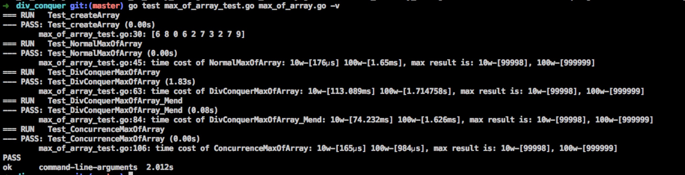

# algorithm

总结leetcode刷题的常见算法

### [Array](https://github.com/yeqown/algorithm-problems/tree/master/array)

* 常见的排序算法
* Binary Search
* Trap RainWater
* Jump Game - II
* Robot Walk
* Stack Implement
* Calculator(Integer)
* etc

### [Backtracking](https://github.com/yeqown/algorithm-problems/tree/master/backtracking)

* Binary Watch
* number permutation

### [BranchBound](https://github.com/yeqown/algorithm-problems/tree/master/branch_conquer)

* leading election
* reordered power of 2

### [DivConquer](https://github.com/yeqown/algorithm-problems/tree/master/div_conquer)

* Sqrt
* Maximum SubArray
* Max of Array (try concurence and channel)

* judge square sum
* `sqrt` implemention

### [DP](https://github.com/yeqown/algorithm-problems/tree/master/dp)

* LIS (Longest Incr SubString)
* LCS (Longest Common SubString)
* LD (Levenshtein Distance)

### [Tree](https://github.com/yeqown/algorithm-problems/tree/master/tree)

* DATrie (not finish)